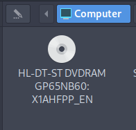
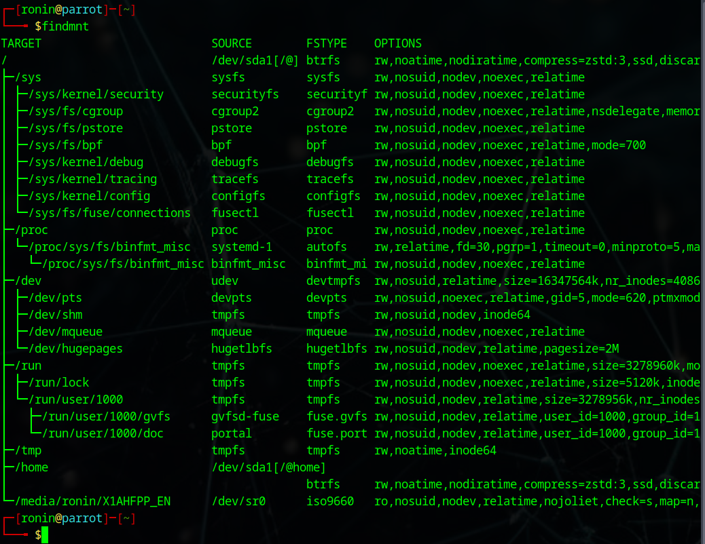
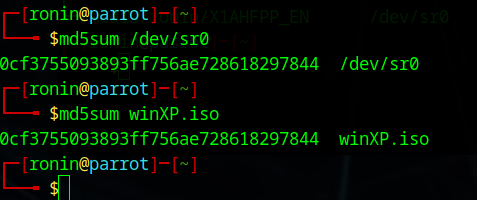
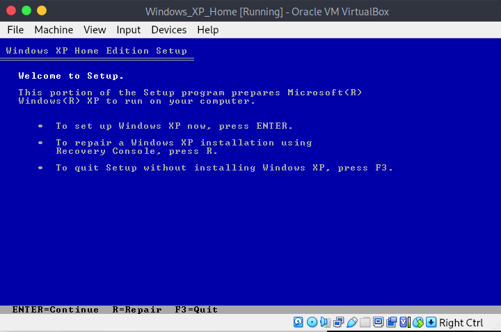

# Disk to ISO Notes

Situation: I have a physical media, a CD in this case. Long ago CD/DVD drives have disappeared from most of my systems. I keep a portable USB DVD writer tucked away for times like these.

## Finding the device on my system

I have a Parrot OS installed on a desktop, so that's where I'm starting from.

Seeing the disk in "Computer", I right clicked and selected mount. Then I right clicked and selected "open in terminal". This gave me a media path: `/media/ronin/X1AHFPP_EN`. This is a directory which wouldn't work with `dd` to capture an ISO.

Normally the aim is to use the device mount, something like this: `/dev/sda1`. Using `findmnt`, I was able to see that the media path was mounted to `/dev/sr0`.

[man findmnt](https://www.man7.org/linux/man-pages/man8/findmnt.8.html)

## Using dd to create an ISO

Now that I have the device location, I can proceed with using `dd` to create my ISO.

A few flags to perform this task. `if` to read from a file and `of` to write to a file.

`dd if=/dev/sr0 of=winXP.iso`

[man dd](https://www.man7.org/linux/man-pages/man1/dd.1.html)

## Validate our iso with an MD5 hash

I used `md5sum` to check that the hash of /dev/sr0 and winXP.iso are the same.

Success! Now, just because the hashes match, doesn't mean we are solid just yet.

## Testing with VirtualBox

I created a new VM in VirtualBox and used my newly minted XP iso. It quickly became apparent it worked.

